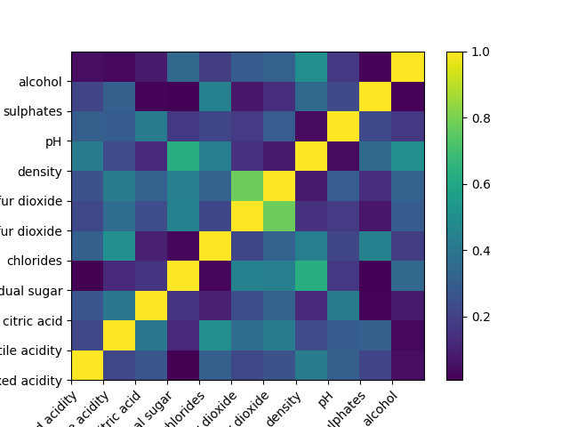
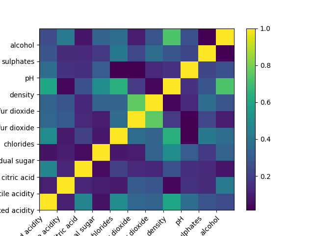

# Wine quality project - Machine Learning 2022

## Goal
Dataset contains 10 classes regarging the quality of thw wines and has been binarized: lower than 6 = 0 and greater than 6 = 1. Wines with quality 6 have been discarded.

11 features in total (attributes)

Classes are hard to separate, expect higher error rates (in the order of ten percent).

---
## Description of the dataset

Attribute Information:

For more information, read [Cortez et al., 2009].
Input variables (based on physicochemical tests):
1 - fixed acidity
2 - volatile acidity
3 - citric acid
4 - residual sugar
5 - chlorides
6 - free sulfur dioxide
7 - total sulfur dioxide
8 - density
9 - pH
10 - sulphates
11 - alcohol
Output variable (based on sensory data):
12 - quality (score between 0 and 10)

## Transformation of data

### K-folds approach

Total amount of samples = 1839. We dropped the last 9 samples to be able to use k=10 fold
Picked the avg of the minDCF since kfold allows observing how different values could be obtained with different combination of data

### Normalization
As a first step before the training of the model, some attributes were found to have a greater range than others, which may generate a bias on the model for the greater numbers; to solve this problem, a normalization of the values was done.
<!-- ### Attribute independence analysis (!!!) I THINK THIS IS NOT TRUE LOL
The attributes were found to be independent from each other after generating the covariance matrix with a maximum covariance of 0.04330498659806576 and a minimum of -0.022902989038180943, which were considered close to zero. The formula used to calculate the covariance was:
$$\mathrm{C} = \dfrac{1}{N}\sum_{i=1}^{N}(x_i-\mu)(x_i-\mu)^T$$
The covaariance matrix generated was:

$$\begin{bmatrix}
0.0127337  & 0.00247947 & 0.00578759 & -0.00247581 & 0.0020966 & -0.0019504 &  -0.00501434 & 0.00984913 & -0.0046221 &  0.00411592 & -0.0017129 \\
0.00247947 & 0.01323005 & -0.00659344 & -0.0051282 &  0.00261141 & -0.00249852 & -0.00627471 & 0.00572255 & 0.0047457 &  0.00272755 & -0.00133022 \\
0.00578759 & -0.00659344 & 0.02197741 & 0.00468772 & 0.00048426 & 0.00151213 &  0.00393123 & 0.00290504 & -0.00722127 & 0.00195716 & 0.00053646 \\
-0.00247581 & -0.0051282 &  0.00468772 & 0.04330499 & -0.00148943 & 0.0054984 &   0.01452776 & 0.0203977 & -0.00870043 & -0.00441169 & -0.0118106 \\
0.0020966 &  0.00261141 & 0.00048426 & -0.00148943 & 0.00384673 & -0.00083649 & -0.00231281 & 0.00440608 & 0.0003991 &  0.00323537 & -0.0027453 \\
-0.0019504 & -0.00249852 & 0.00151213 & 0.0054984 & -0.00083649 & 0.00448633 &  0.00656014 & 0.0004435 & -0.00108317 & -0.00087798 & -0.0017517 \\
-0.00501434 & -0.00627471 & 0.00393123 & 0.01452776 & -0.00231281 & 0.00656014 &  0.01799781 & 0.00116412 & -0.00480633 &-0.00435532 & -0.00631409 \\
0.00984913 & 0.00572255 & 0.00290504 & 0.0203977 &  0.00440608 &  0.0004435 &   0.00116412 & 0.03474703 & -0.000851 &   0.00614918 & -0.02290299 \\
-0.0046221 &  0.0047457 & -0.00722127 & -0.00870043 & 0.0003991 & -0.00108317 & -0.00480633 & -0.000851 &   0.02061766 & 0.00352868 & 0.00351852 \\
0.00411592 & 0.00272755 & 0.00195716 & -0.00441169 &  0.00323537 & -0.00087798 &  -0.00435532 & 0.00614918 & 0.00352868 & 0.01657311 & 0.00045398 \\
-0.0017129 & -0.00133022 & 0.00053646 & -0.0118106 & -0.0027453 & -0.0017517 &  -0.00631409 & -0.02290299 & 0.00351852 & 0.00045398 & 0.03152529 \\

\end{bmatrix} $$ -->

### Gaussianization
When plotting the graphs for each attribute, it was noticed that some values were "too far" from the others, which means that they are probably outliers. Furthermore, the general "format" for some features seemed to have a different form expected for a gaussian distribution. An example of such case can be seen in the following image:

PUT AN EXAMPLE HERE ---------------------------------------

Given that observations, a gaussianization process was done, first by computing the ranking over the training dataset:

$r(x) = \dfrac{ \sum_{i=1}^{N} I[x_i < x] + 1 }{N + 2}$

Where I is the indicator function and N is the number of samples.
Finally, it is applied the percent point function for each sample calculated.

### Dimension reduction
(!!!) LETS EVALUATE WHICH ATTRIBUTES ARE RELEVANT FOR THE CLASSIFICATION

## Gaussean models analysis

### Correlation

A correlation analysis of Gaussianized features shows that for both classes the 'total sulfur dioxide' and 'free sulfur dioxide' attributes are highly correlated, while other features are also somehow correlated.

This means that the assumption of independence for Naive Balles classifier are not strictly accomplished and we'll probably get better results with a Full Covariance model.

### Covarianze

The coavariance matrix for the two classes were found not to be equal, which means that using a Tied Covariance model would also get worst results than non tied models. 

### Results report

Initially, the model was run with the original unchanged data, which achived with a π=0.5 a mean DCF of 0.290 and with a π=0.4 a DCF of 0.356; for the gaussianissed data without PCA on a π=0.5 it achived a DCF of 0.291 and for a π=0.4 it got a DCF of 0.352. An improvement by the gausseanization of the data was expected as representative outliners were found, also, a decrease on the prior probability for class 1, which has less samples, was expected to improve the result, which it didnt. Finally, a PCA for m=10 was used on the gausseanissed data the reduce furthermore the effect of the codependence of the attributes. For a π=0.5 an improved DCF of 0.292 was achived and with π=0.4 the DCF was 0.359.

# What to include in the report

## Analysis of the problem

Analyze the attributes, kind of features, their ranges, distributions etc.
Possible steps:

- Plot their distributions (as in lab 2) to evaluate the distribution of each attribute: if big overlap, maybe not so good features for evaluation --> We can use it to select the parameters;

## Different models

We only have seen some:
- Logistic regression model